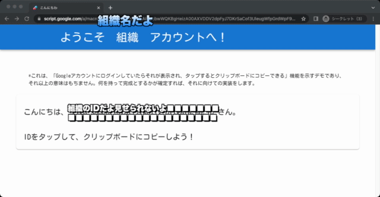

# what's this?

「IDをタップでコピーしたい！」という要望があったので作成した、ログインしているWorkspaceアカウントのIDを表示・クリックすればクリップボードにコピーするやつ

# (my own personal circumistancies and notes)

Apple ID x Google Workspace (x MS, Office A1)で流用できる、Microsoft Azure ADで管理統合された環境を想定しよう。使用する端末はiPadだが、端末情報の管理はAAD・Workspaceではまったく扱わない。iPadはMDM管理下にあり、Apple IDはASMによって管理されている。

使用するMDMおよびiPadOSの仕様により、「ログインしているApple IDとiPadのシリアルナンバーが紐付けられない」という状況で、なんとかしてMDM管理画面からログインしているIDを取得したい。

iPadOSのバグかどうかは知らないが、設定アプリのApple IDの項目はコピーができるようになっているものの、コピーすると**Apple IDという文字がコピーされる**というとんでもない仕様（iPadOS15, 16現在）。落語か。

ということで解のひとつとして提示した。Workspaceアカウントへのログインが必要だが、前提からしてログインしている状態が期待されるものであり、ログアウトしていたら再ログインすればいいだけである。（そもそもiPadにログインしてないと、当初の「設定アプリからコピー」すらできないので、ログイン先が変わっただけで、手間といえばデプロイしたURLの配布くらいだろうか。あとネットワーク）

ひとつ懸念として、Google Apps Scriptのプロジェクト単位での関数の同時実行数に上限が存在し、それが非常に低い（30）ことがある。現在は`doGet`および`getUserID`のみの薄い仕様で、実行は1秒以内に終わるのだが、たとえば数万オーダーのクライアントがいるとすれば、リミットを迎えるタイミングが発生しそうである。ただ、その場合でも、ほんの少しあとで（なんでもいいが、数秒後とか）再チャレンジしたり、一斉にやるタイミングをずらせばよい程度の誤差である。

展望として、フロント側で、IDに合わせて表示を変えたりする機能の追加を考えている。